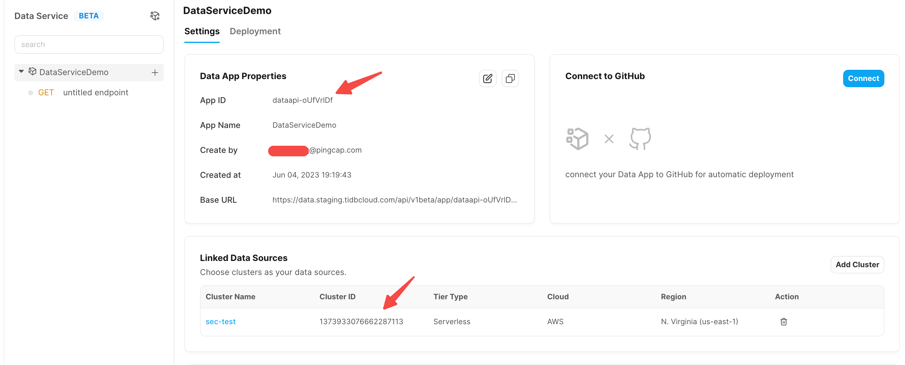
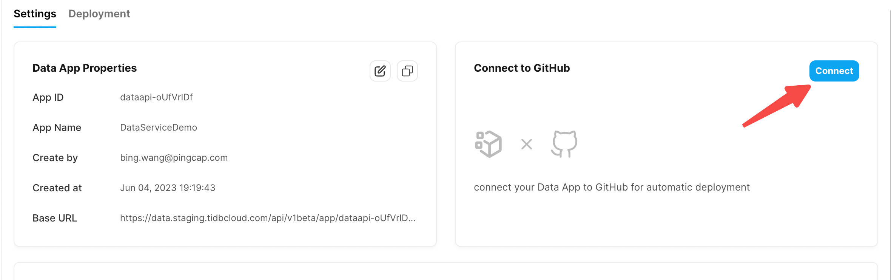
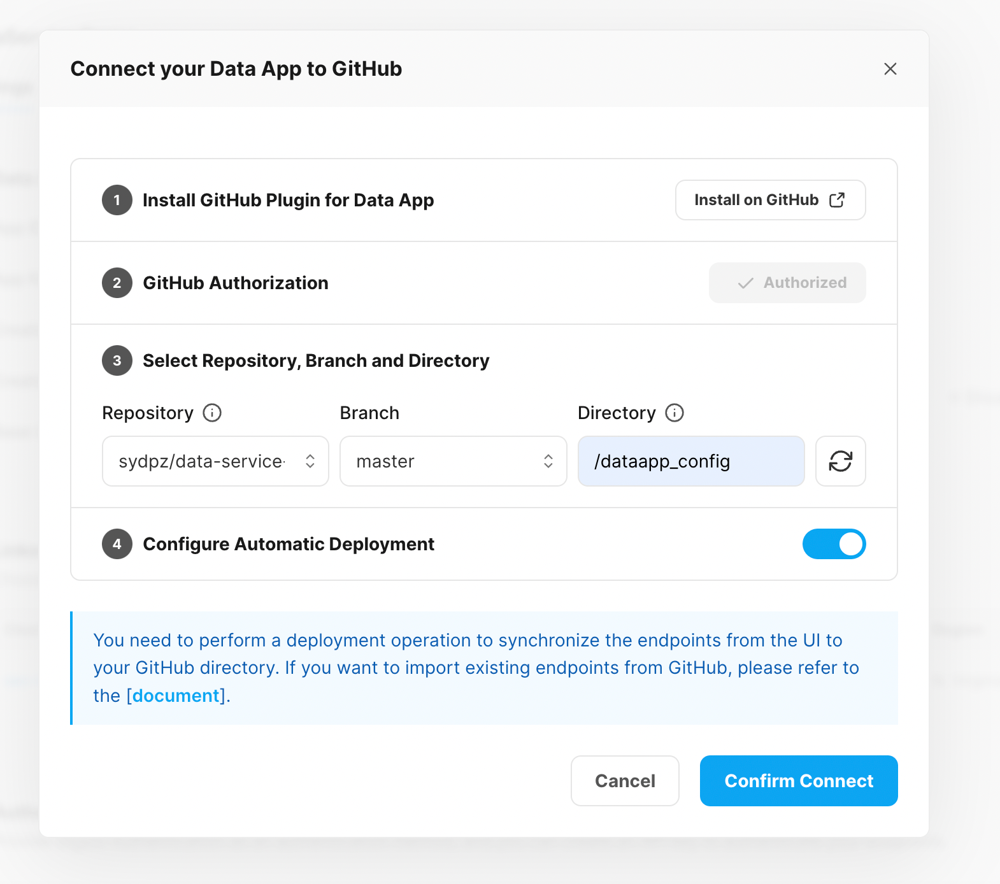
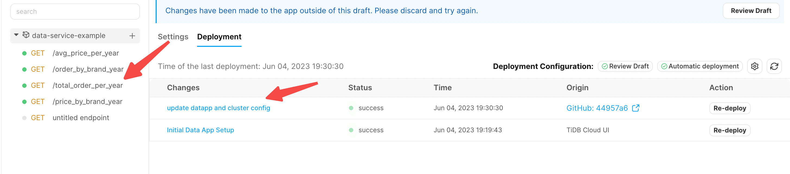
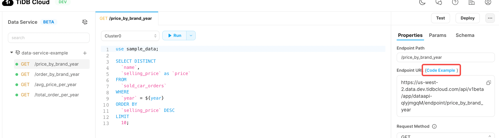
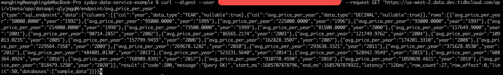
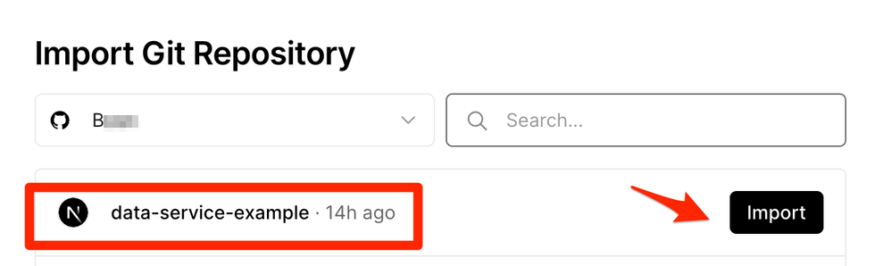
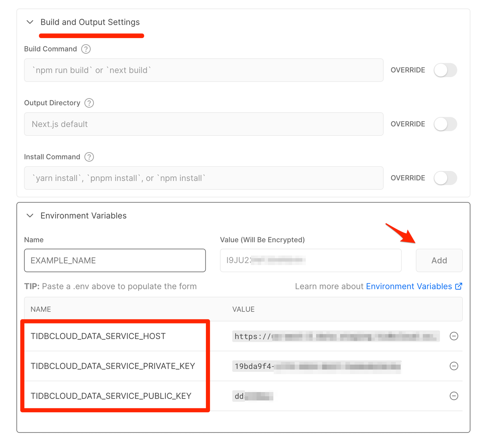

# lab2-build-an-app-with-tidbcloud-dataservice

Follow the [guide](https://github.com/tidbcloud/data-service-example) step by step.
1. Create a new DataApp in TiDB Cloud Data Service
2. Associate the github repo with TiDB Cloud DataApp
3. Launch the web application


# Step-by-step: 4 steps to launch the sample application within 10 minutes
## Step1: Preparation
Before you start, ensure to have the following set up:
1. Fork the source code of the sample application: [click here](https://github.com/tidbcloud/data-service-example/fork) . ( you will need a Github account first).
2. Sign up for a TiDB Cloud account and login to use TiDB Cloud Data Service later: [click here](https://tidbcloud.com/console/data-service), and it will automatically give you a serverless TiDB database for free, which has 5GB free storage by default. The auto-creation of database will take no more than a minute.

## Step2: Create a new DataApp in TiDB Cloud Data Service
1. Log in to https://tidbcloud.com and select the `DataService` from the left sidebar. On the `DataService` page, create a new `DataApp`. Keep the `Connect to GitHub` switch off.


> Note:
> 1. If there are no clusters existing under your project, you can click on create cluster to first create a database. Once the database is created, proceed to create a new DataApp.
> 2. If you have already created a DataApp, check the top-right corner of the DataApp sidebar.

2. Take note of the `{APP_ID}` for the current DataApp creation and the `{CLUSTER_ID}` associated with the cluster. We will need these two values later to configure the backend code repository.


## Step3: Associate your github repo with TiDB Cloud DataApp
1. Connect your github repo with DataApp

> 1.1 Click the `connect` button in the `connect to Github` area of the configuration page.

> 1.2 In the pop-up window, follow the prompts to complete the corresponding operation steps.


2. Trigger the DataApp deployment via git push
In this step, we need to configure the previously recorded `{APP_ID}` and `{CLUSTER_ID}` into the current code repository, and then execute `git commit && push` to trigger the deployment of the DataApp.
In your terminal window, perform the following actions in the `dataapp_config` directory of the code repository:

For Mac systems:
```
cd ./dataapp_config
sed -i '' 's/${APP_ID}/{your app ID}/g' dataapp_config.json
sed -i '' 's/${CLUSTER_ID}/{your cluster ID}/g' ./data_sources/cluster.json
sed -i '' 's/${CLUSTER_ID}/{your cluster ID}/g' ./http_endpoints/config.json
```

For Linux systems：
```
cd ./dataapp_config
sed -i  's/${APP_ID}/{your app ID}/g' dataapp_config.json
sed -i  's/${CLUSTER_ID}/{your cluster ID}/g' ./data_sources/cluster.json
sed -i  's/${CLUSTER_ID}/{your cluster ID}/g' ./http_endpoints/config.json
```
After the replacement is completed, execute the git commit && push operation.
```
git commit . -m "update the param config"
git push
```

At this point, go back to the webpage of the DataApp, and you will see a deployment record from GitHub. This deployment record is triggered and deployed through GitHub.


Now you need to refresh the page to see the latest APIs. You can see four endpoints successfully imported from Github on the left pane.

3. Verify the DataApp deployment is successful

We have completed the creation of DataApp and now we are testing if our newly created DataApp works appropriately.

> 3.1 Create an ApiKey `{publickey}:{privatekey}` in DataApp and save it to local.
On the authentication property of the data app property page, click the Create API Key button. This will generate a `{publickey}:{privatekey}` pair.  Please save it locally.


> 3.2 Choose an endpoint and test if it is working correctly.
Click on any endpoint in DataApp and click code example in the right-side panel; click online environment in the pop-up window, and copy the curl command into your terminal window.


Replace the fields `<PublicKey>` and `<PrivateKey>` in the copied content with the previously generated public key and private key. Send the request on the command line. If the corresponding data is returned normally, it indicates that the current DataApp has been set up successfully.


## Step4: Launch the web application
  
Next, we'll implement the web app using the full-stack framework Next.js and deploy it conveniently via Vercel within 10 minutes.

4. Build and deploy the web app demo locally
After forked and updated the demo app repository, clone the repository to local, create a .env file in the root directory to specify some environment variables that shouldn't be hardcoded in the source code and can be easily changed on-the-fly
```
TIDBCLOUD_DATA_SERVICE_PUBLIC_KEY=YOUR PUBLIC_KEY
TIDBCLOUD_DATA_SERVICE_PRIVATE_KEY=YOUR PRIVATE_KEY
TIDBCLOUD_DATA_SERVICE_HOST=https://us-east-1.data.tidbcloud.com/api/v1beta/app/${APP_ID}/endpoint
```
Run commands below to start a local dev server. If things go well, you could visit https://localhost:3000 to see the demo as the screenshot.
```
npm i && npm run dev
```
5. Build and deploy the web app demo via Vercel
Deploy our demo app to Vercel only take 3 minutes! Visit Vercel, register an account if you don't have one. Import the Git repository we forked & updated.

Add environmental variables here, and press the Deploy button, wait some minutes and all things get to work!

Upon successful deployment, we've finished the production deployment!
